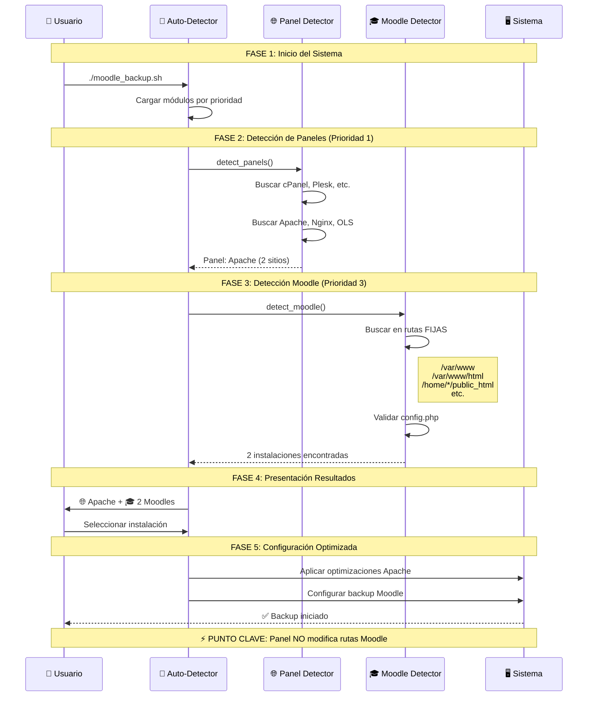

```mermaid
graph TB
    %% Inicio del Sistema
    A[👤 Usuario ejecuta: ./moodle_backup.sh] --> B[🔧 Auto-Detector Principal<br/>src/detection/auto-detector.sh]
    
    %% Módulos de Detección por Prioridad
    B --> C{📋 Módulos por Prioridad}
    
    %% Prioridad 1: Paneles/Servidores Web
    C -->|Prioridad 1| D[🌐 Detección Paneles/Servidores<br/>src/detection/panels.sh]
    
    %% Prioridad 2: Directorios  
    C -->|Prioridad 2| E[📁 Detección Directorios<br/>src/detection/directories.sh]
    
    %% Prioridad 3: Instalaciones Moodle
    C -->|Prioridad 3| F[🎓 Detección Moodle<br/>src/detection/moodle.sh]
    
    %% Prioridad 4: Bases de Datos
    C -->|Prioridad 4| G[🗄️ Detección Base Datos<br/>src/detection/database.sh]
    
    %% Detalle Detección Paneles
    D --> D1[🎛️ Paneles de Control]
    D --> D2[🌐 Servidores Web]
    
    D1 --> D1a[cPanel<br/>Plesk<br/>DirectAdmin<br/>ISPConfig<br/>Webmin<br/>VestaCP<br/>HestiaCP<br/>CyberPanel<br/>aaPanel]
    
    D2 --> D2a[Apache<br/>Nginx<br/>OpenLiteSpeed]
    
    %% Detalle Detección Moodle
    F --> F1[📍 Rutas de Búsqueda FIJAS]
    F1 --> F2[/var/www<br/>/var/www/html<br/>/home/*/public_html<br/>/home/*/www<br/>/usr/local/apache/htdocs<br/>/opt/bitnami/apache2/htdocs<br/>/srv/www<br/>/www<br/>Directorio actual]
    
    F2 --> F3[🔍 Buscar config.php]
    F3 --> F4[✅ Validar Instalación]
    F4 --> F5[📊 Extraer Información]
    
    %% Consolidación de Resultados
    D --> H[📋 Consolidación Resultados]
    E --> H
    F --> H
    G --> H
    
    %% Presentación al Usuario
    H --> I[📺 Presentar al Usuario]
    I --> I1[🌐 Sistema: Apache detectado<br/>🎓 Instalaciones: 2 encontradas]
    
    %% Selección
    I1 --> J{🎯 ¿Múltiples Instalaciones?}
    J -->|Sí| K[⚡ Selección Interactiva]
    J -->|No| L[🚀 Configuración Automática]
    
    K --> M[👤 Usuario selecciona instalación]
    M --> N[🔧 Configurar Backup]
    L --> N
    
    %% Configuración Final
    N --> O[📊 Aplicar Optimizaciones<br/>según Panel Detectado]
    O --> P[🎉 Iniciar Backup]
    
    %% Relaciones Importantes
    D -.->|"Información<br/>Contextual"| N
    F -.->|"Instalación<br/>Seleccionada"| N
    
    %% Estilos
    classDef userAction fill:#e1f5fe,stroke:#01579b,stroke-width:2px,color:#000
    classDef detection fill:#f3e5f5,stroke:#4a148c,stroke-width:2px,color:#000
    classDef moodle fill:#e8f5e8,stroke:#1b5e20,stroke-width:2px,color:#000
    classDef result fill:#fff3e0,stroke:#e65100,stroke-width:2px,color:#000
    classDef config fill:#fce4ec,stroke:#880e4f,stroke-width:2px,color:#000
    
    class A,M userAction
    class B,C,D,E,F,G detection
    class F1,F2,F3,F4,F5 moodle
    class H,I,I1,J result
    class K,L,N,O,P config
```

## 🔄 Flujo de Datos: Panel → Moodle → Backup



## 📊 Matriz de Relaciones: Panel vs Rutas de Búsqueda

| Panel Detectado   | ¿Modifica Rutas Moodle? | Rutas Búsqueda       | Optimizaciones              |
| ----------------- | ----------------------- | -------------------- | --------------------------- |
| **cPanel**        | ❌ **NO**                | Rutas estándar fijas | ✅ Comandos cPanel, logs WHM |
| **Plesk**         | ❌ **NO**                | Rutas estándar fijas | ✅ Herramientas Plesk        |
| **Apache**        | ❌ **NO**                | Rutas estándar fijas | ✅ VirtualHosts, logs Apache |
| **Nginx**         | ❌ **NO**                | Rutas estándar fijas | ✅ Server blocks, logs Nginx |
| **OpenLiteSpeed** | ❌ **NO**                | Rutas estándar fijas | ✅ Configuración OLS         |
| **Sin Panel**     | ❌ **NO**                | Rutas estándar fijas | ✅ Configuración genérica    |

**🎯 CONCLUSIÓN:** La búsqueda de Moodle es **independiente** del panel detectado
