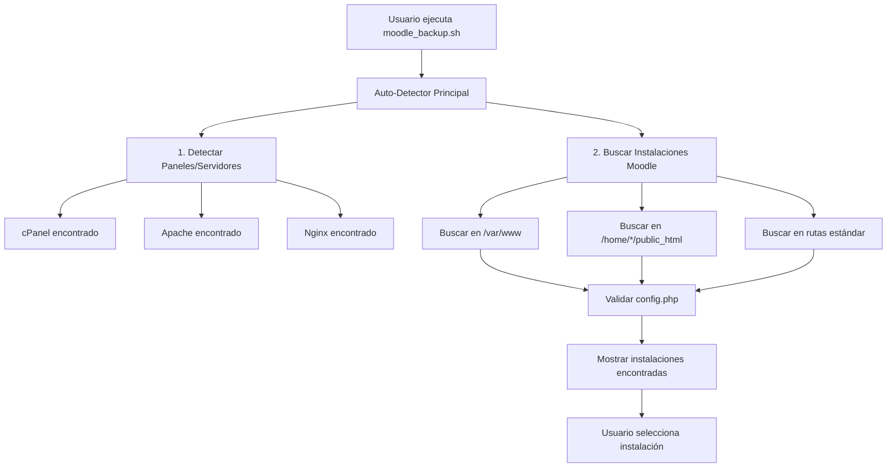

# Flujo de Detección de Servidores Web y Moodle

## Resumen del Flujo de Usuario

Este documento explica claramente cómo funciona el sistema de detección automática y qué ve el usuario en la terminal cuando ejecuta el CLI de backup de Moodle.

## 🔄 Flujo Principal de Detección

### 1. **Inicio del Sistema** 
```bash
./moodle_backup.sh
```

El usuario ejecuta el script principal y el sistema inicia en este orden:

### 2. **Auto-Detector Principal** (`src/detection/auto-detector.sh`)
El sistema carga y ejecuta módulos de detección **por prioridad**:

```
Prioridad 1: PANELES/SERVIDORES WEB 🌐
Prioridad 2: DIRECTORIOS 📁  
Prioridad 3: INSTALACIONES MOODLE 🎓
Prioridad 4: BASES DE DATOS 🗄️
```

### 3. **Detección de Paneles/Servidores Web** (`src/detection/panels.sh`)

El sistema busca automáticamente:

#### 🎛️ **Paneles de Control Detectados:**
- **cPanel** → `/usr/local/cpanel/bin/whmapi1`
- **Plesk** → `/opt/psa/bin/admin`  
- **DirectAdmin** → `/usr/local/directadmin/custombuild`
- **ISPConfig** → `/usr/local/ispconfig/server/server.php`
- **Webmin** → `/etc/webmin/config`
- **VestaCP** → `/usr/local/vesta/bin/v-list-users`
- **HestiaCP** → `/usr/local/hestia/bin/v-list-users`
- **CyberPanel** → `/usr/local/CyberCP/manage.py`
- **aaPanel** → `/www/server/panel/BT-Panel`

#### 🌐 **Servidores Web Detectados (NUEVO):**
- **Apache** → `/etc/httpd/` o `/etc/apache2/`
- **Nginx** → `/etc/nginx/` 
- **OpenLiteSpeed** → `/usr/local/lsws/`

### 4. **¿Qué Ve el Usuario en la Terminal?**

```bash
[2025-01-15 10:30:15] [INFO] Iniciando detección automática...
[2025-01-15 10:30:15] [INFO] Ejecutando detección: panels
[2025-01-15 10:30:16] [SUCCESS] ✓ Panel detectado: Apache (2 sitios web encontrados)
[2025-01-15 10:30:16] [INFO] Ejecutando detección: moodle  
[2025-01-15 10:30:17] [INFO] Buscando Moodle en rutas por defecto...
[2025-01-15 10:30:18] [SUCCESS] ✓ Instalación Moodle encontrada: /var/www/html/moodle
[2025-01-15 10:30:18] [SUCCESS] ✓ Instalación Moodle encontrada: /home/user1/public_html/learning
```

### 5. **Búsqueda de Instalaciones Moodle** (`src/detection/moodle.sh`)

**IMPORTANTE:** La detección de paneles/servidores web **NO modifica** las rutas de búsqueda de Moodle. El sistema **siempre busca** en las mismas rutas predefinidas:

```bash
MOODLE_SEARCH_PATHS=(
    "/var/www"                    # Apache/Nginx estándar
    "/var/www/html"              # Apache Ubuntu/Debian
    "/home/*/public_html"        # Usuarios cPanel/DirectAdmin
    "/home/*/www"                # Usuarios alternativos
    "/usr/local/apache/htdocs"   # Apache cPanel/WHM
    "/opt/bitnami/apache2/htdocs" # Bitnami
    "/srv/www"                   # SUSE/openSUSE
    "/www"                       # OpenLiteSpeed
    "${PWD}"                     # Directorio actual
)
```

### 6. **Relación Panel ↔ Instalaciones Moodle**



### 7. **¿Para Qué Sirve Detectar el Panel/Servidor?**

La detección de paneles/servidores web tiene **propósitos informativos y de contexto**:

#### 📊 **Información del Sistema:**
```bash
[INFO] Sistema detectado:
- Panel: cPanel v102.0.18
- Servidor Web: Apache 2.4.54  
- Sitios web: 5 dominios encontrados
- Instalaciones Moodle: 2 encontradas
```

#### 🎯 **Optimizaciones Específicas:**
- **cPanel**: Usar comandos específicos de WHM/cPanel para backup
- **Plesk**: Utilizar herramientas de Plesk para gestión de dominios
- **Apache**: Verificar configuración de VirtualHosts
- **Nginx**: Revisar configuración de server blocks

#### 🔧 **Configuraciones Automáticas:**
- **Rutas de logs** específicas del panel
- **Permisos de usuario** según el tipo de panel
- **Comandos de reinicio** específicos del servidor web

### 8. **Flujo de Selección Interactiva**

Si se encuentran múltiples instalaciones:

```bash
Instalaciones Moodle encontradas:

1) /var/www/html/moodle (v4.1.2) - Base de datos: moodle_prod
2) /home/cliente1/public_html/learning (v3.11.8) - Base de datos: cliente1_moodle  
3) /home/cliente2/public_html/elearning (v4.2.1) - Base de datos: elearning_db

Seleccione la instalación a respaldar [1-3]: _
```

### 9. **Integración con Backup**

Una vez seleccionada la instalación:

```bash
[INFO] Instalación seleccionada: /var/www/html/moodle
[INFO] Panel detectado: cPanel - optimizando configuración
[INFO] Configurando backup para Moodle v4.1.2
[INFO] Base de datos: moodle_prod (MySQL)
[INFO] Dataroot: /home/moodledata
[SUCCESS] ✓ Configuración completada - iniciando backup...
```

## 🔑 Puntos Clave del Flujo

### ✅ **Lo que SÍ hace la detección de paneles:**
1. **Identifica el entorno** (cPanel, Plesk, Apache, etc.)
2. **Proporciona contexto** para optimizaciones específicas
3. **Informa al usuario** sobre el sistema detectado
4. **Permite configuraciones** específicas por tipo de panel

### ❌ **Lo que NO hace la detección de paneles:**
1. **NO modifica** las rutas de búsqueda de Moodle
2. **NO restringe** la búsqueda a rutas específicas del panel
3. **NO es prerequisito** para encontrar instalaciones Moodle

### 🎯 **Búsqueda de Moodle es Independiente:**
- **Siempre** busca en rutas estándar predefinidas
- **Valida** cada `config.php` encontrado
- **Funciona** sin importar el panel detectado
- **Es robusta** para cualquier configuración de servidor

## 📝 Conclusión

El sistema de detección está diseñado para ser:
- **🔄 Automático**: Sin intervención del usuario  
- **🎯 Robusto**: Encuentra Moodle independientemente del panel
- **📊 Informativo**: Proporciona contexto del servidor
- **⚡ Eficiente**: Búsqueda optimizada con cache y timeouts
- **🔧 Flexible**: Funciona en cualquier entorno Linux

La detección de paneles/servidores web **complementa** la búsqueda de Moodle pero **no la condiciona**, garantizando que el sistema funcione en cualquier configuración de servidor.
